# Pokémon Randomiser
## _devops-practical-project_

---
## Contents
* [Introduction](#introduction)
	* [Objective](#objective) 
	* [Outline](#outline) 
* [Project Plan](#project-plan)
	* [Continuous Integration Pipeline](#continuous-integration-pipeline)
	* [Risk Assessment](#risk-assessment)  
	* [Kanban Board](#kanban-board)
	* [Entity Diagram](#entity-diagram)
* [Development](#development)
	* [Unit Testing in VS Code](#unit-testing-in-vs-code)
	* [Unit Testing with CI server](#unit-testing-with-ci-server)
	* [Front-End](#front-end)
* [Footer](#footer)
	* [Future Improvements](#future-improvements)
	* [Author](#author)
	* [Acknowledgements](#acknowledgements)

  
## Introduction
---
 

### Objective

The overall objective with this project is the following: 

    - To create a service-orientated architecture for an application, composed of at least 4 services that work together.

### Outline

The application created for this project is a Pokémon randomiser. Just like in the original series of Pokémon games, users will be able to choose from 1 of 3 Poké Balls that appear on the screen, in which they will then receive a Pokémon. In this application, the Pokémon that the user receives will be generated completely randomly.

 

#### Service 1

The core service. This will display the front end of the application in which the user will interact with. It will also be responsible for communicating with the other 3 services, and persisting data in an SQL database.
 

#### Service 2 & 3

These will both generate a random “Object”. In this case, the objects are:
- The region that the Pokémon comes from e.g. Kanto or Johto.
- The type of Pokémon e.g. Fire or Water.
 

#### Service 4

This service will also create an “Object” however this “Object” must be based upon the results of service #2 + #3 using some pre-defined rules. In this case, the object will be the name of the Pokémon.

 

  

## Project Plan
---
 

### Continuous Integration/Continuous Development Pipeline

The tech stack I used for this project is as follows: 

	- Kanban Board: Jira
    - Version Control: GitHub
    - CI Server: Jenkins
    - Configuration Management: Ansible
    - Cloud server: GCP Compute Engine
    - Containerisation: Docker Compose
    - Orchestration Tool: Docker Swarm
    - Reverse Proxy: NGINX

 

The key components of the Continuous Integration/Continuous Development (CI/CD) pipeline and how they relate to each other can be described like this:

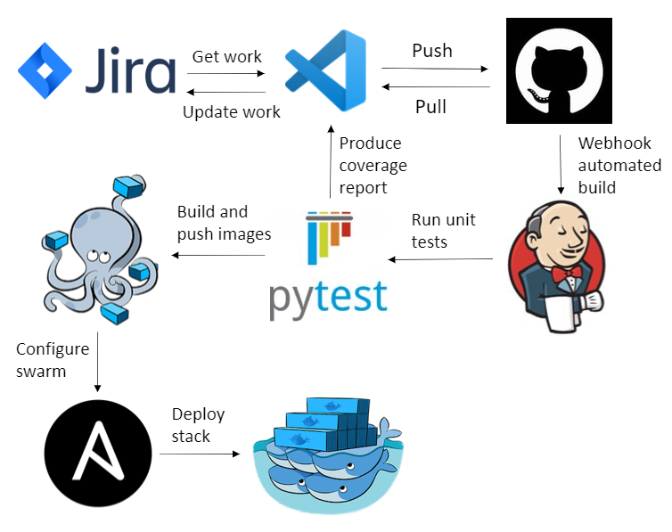
  

### Services Diagram

The services that are built using Docker Compose can be described like this:
 

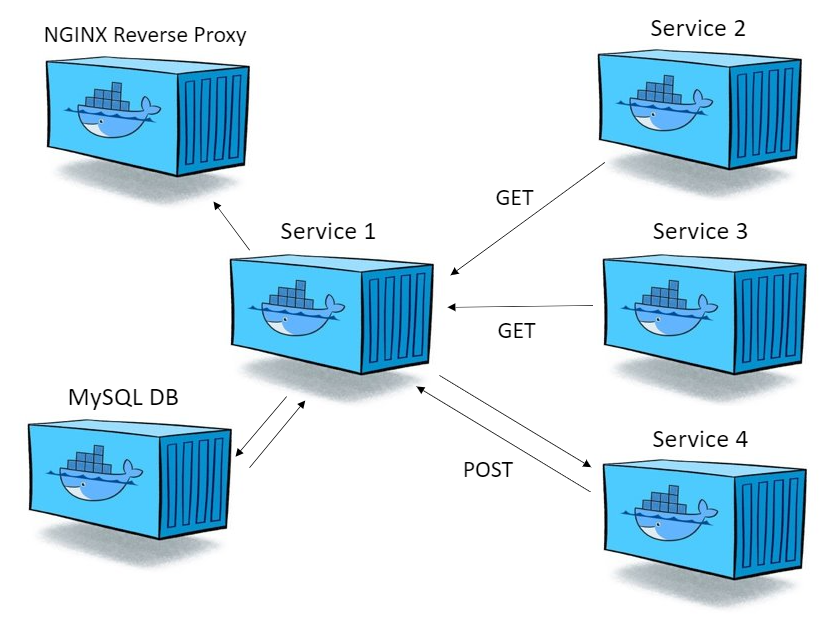
 

Note that this includes the 4 key services as defined above and another 2 services: a MYSQL database for persisting data, and an NGINX reverse proxy to forward client requests.

### Infrastructure Diagram

The layout of the GCP virtual machines and how they relate to the user can be described like this:
 

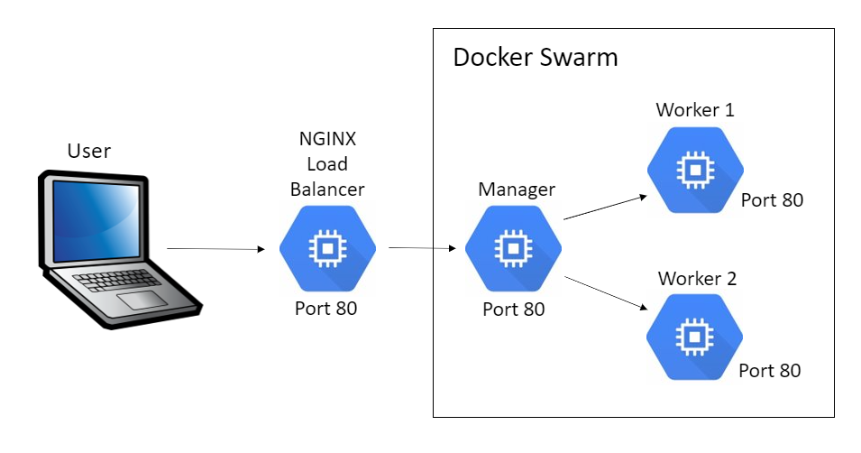

### Risk Assessment

Here is a link to my [Risk Assessment](https://qalearning-my.sharepoint.com/:x:/r/personal/gwilliams_qa_com/_layouts/15/Doc.aspx?sourcedoc=%7B255307FC-973C-4974-99FC-A6EA20C3DBC8%7D&file=Risk%20Assessment2.xlsx&wdOrigin=OFFICECOM-WEB.START.REC&ct=1629035289875&action=default&mobileredirect=true)
, as well as the image below where I have detailed descriptions of the potential risks and control measures associated with this project.

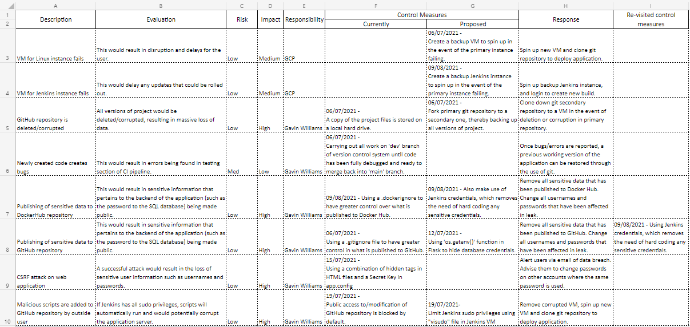

 

### Kanban Board

I decided to use Jira for my Kanban Board, as I like the general layout and options it gives to the user.
Here is a link to my [Kanban Board.](https://team-1624354737559.atlassian.net/jira/software/projects/DPP/boards/7/roadmap)

My completed project road map is as follows:

Firstly, I planned a list of tasks from a project development standpoint, such as writing out a risk assessment and designing an entity diagram.

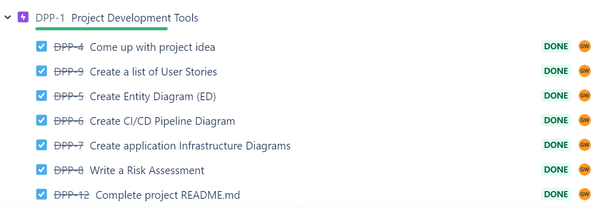
  

Secondly, I wrote a list of user stories. These were a guide to what I wanted the functionality of my application to incorporate, such as allowing the user to filter by Pokémon type.

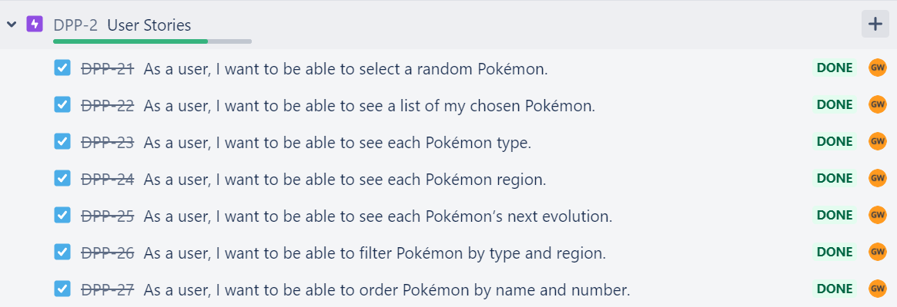
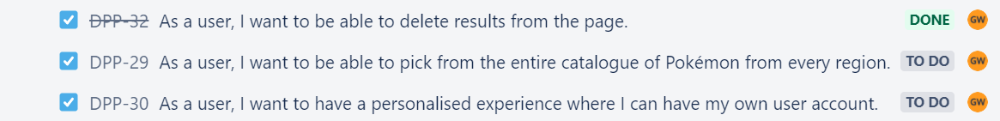
  

Lastly, I planned a list of tasks based off of creating a continuous integration/continuous development (CI/CD) pipeline for my flask application.

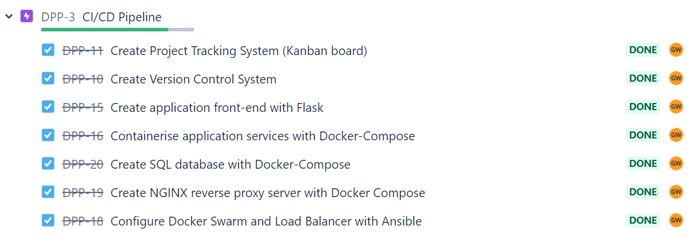
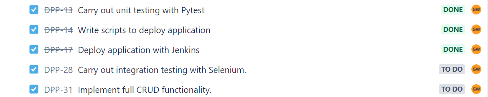
  

### Entity Diagram

Here is the initial entity diagram for this application, incorporating the key attributes that were needed for this application to function:

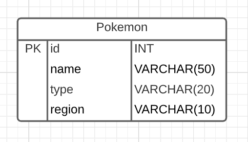
  
Here is the final entity diagram, which gradually grew throughout the project as I added additional functionality to the application. It keeps all of the attributes of the first draft, but adds functionality such as displaying the Pokémon number and evolution. To display an image for every Pokémon and its evolution in the application, I defined two image link attributes as can be seen in the image below:

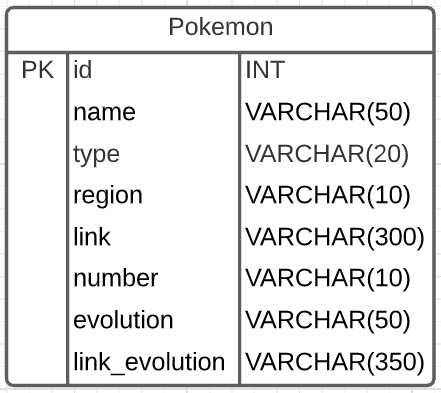
  

## Development
---
 

### Jenkins Pipeline

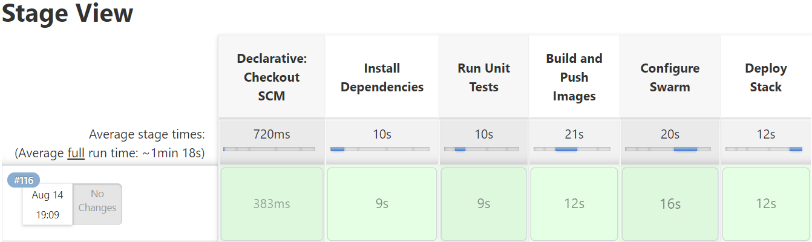

### Unit Testing with CI server

Here is the testing output from the Jenkins pipeline, which shows 7 passed tests and 98% overall coverage.

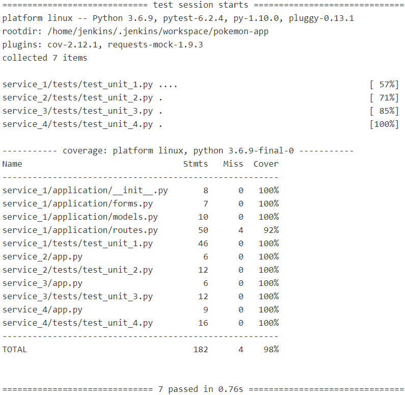
  

Here is the Cobertura coverage report, which shows the test coverage across all areas of the application:

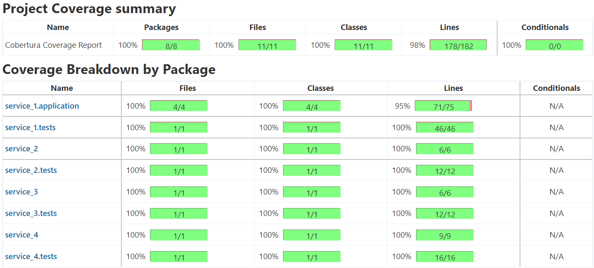
  

Here is the JUnit test output, which reports 0 failures for every function in every test class:

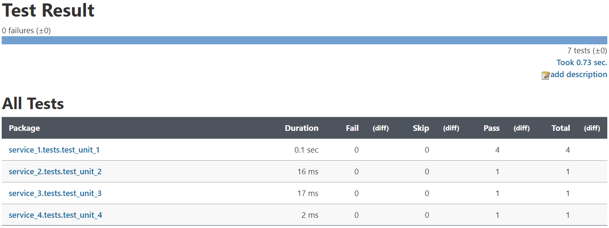
  

Here is the webhook configured to trigger a Jenkins build once there has been a push to GitHub. This allows for automated testing for every change that is made to the source code:

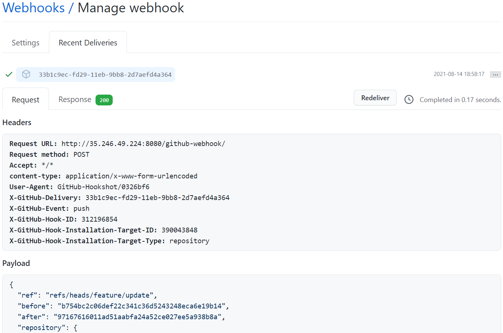
  

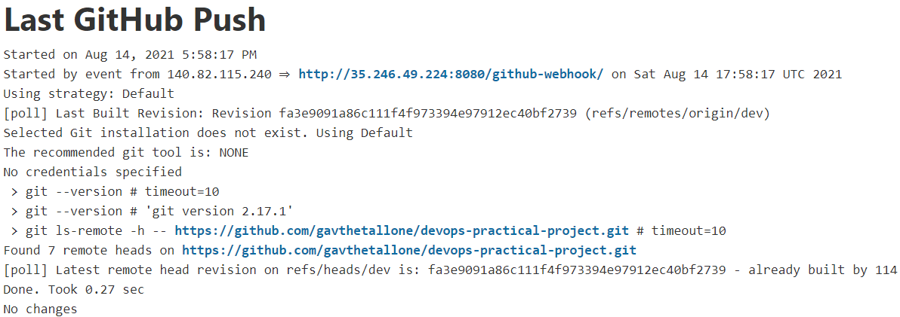

  

### Refactoring

[Insert here stuff about storing images locally to improve speed.]

[Insert here stuff about changing code for forms in application/routes to "order_attr" dictionary which simplified code and boosted test coverage]

[Delete Selenium and unnneccesary dependencies]
  

### Front-End

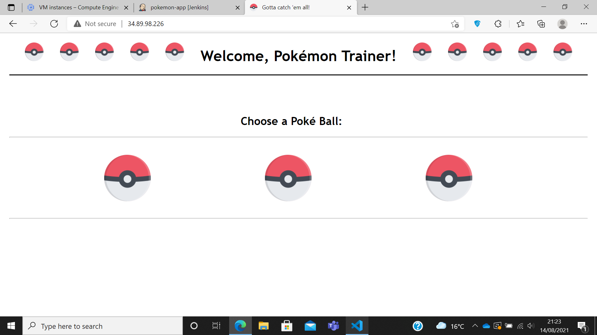
  

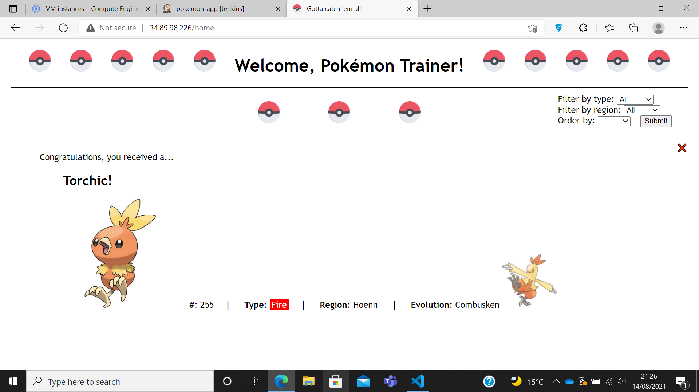
  

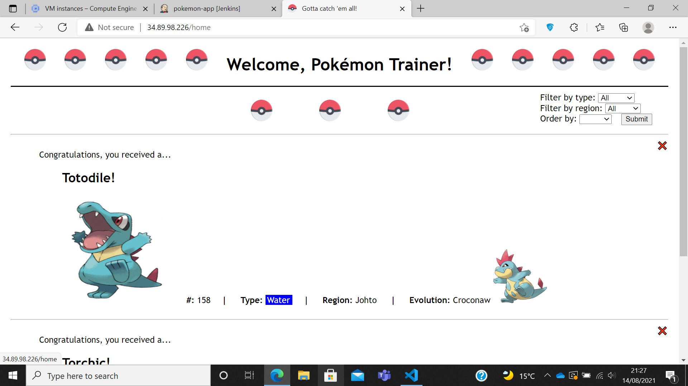
  

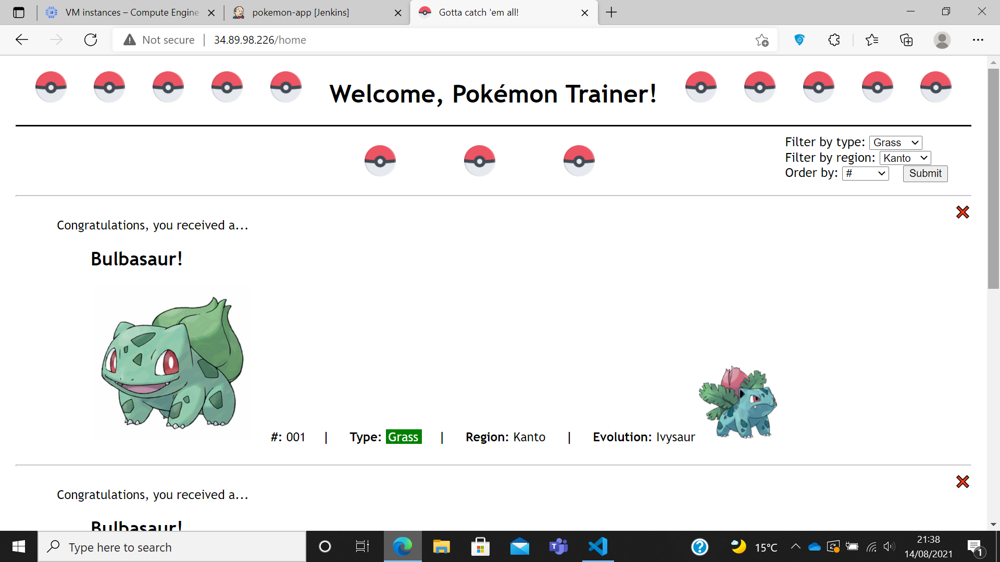

 

## Footer
---
 

### Future Improvements

 

### Author

Gavin Williams

 

### Acknowledgements

* [Oliver Nichols](https://github.com/OliverNichols/)
* Ryan Wright