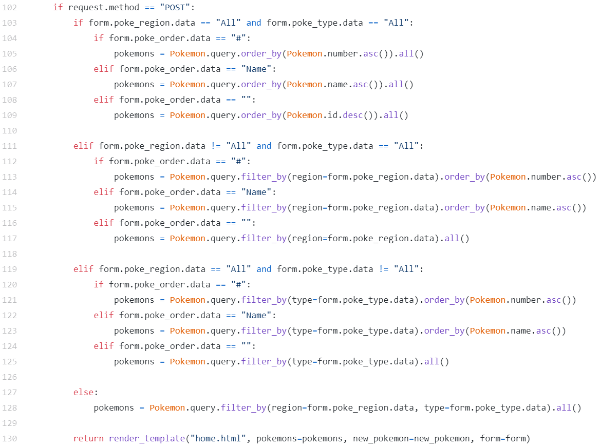
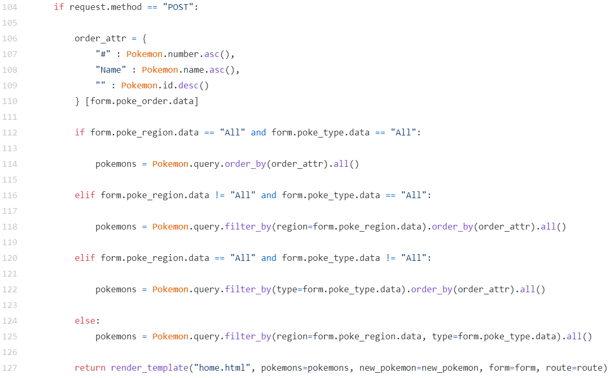

# Pokémon Randomiser
## _devops-practical-project_

---
## Contents
* [Introduction](#introduction)
	* [Objective](#objective) 
	* [Outline](#outline)
* [Project Plan](#project-plan)
	* [CI-CD Pipeline](#ci-cd-pipeline)
	* [Services Diagram](#services-diagram) 
	* [Infrastructure Diagram](#infrastructure-diagram) 
	* [Risk Assessment](#risk-assessment)
	* [Kanban Board](#kanban-board)
	* [Entity Diagram](#entity-diagram)
* [Development](#development)
	* [Jenkins Pipeline](#jenkins-pipeline)
	* [Unit Testing in VS Code](#unit-testing-in-vs-code)
	* [Unit Testing with CI server](#unit-testing-with-ci-server)
	* [Refactoring](#refactoring)
	* [Front-End](#front-end)
* [Footer](#footer)
	* [Future Improvements](#future-improvements)
	* [Author](#author)
	* [Acknowledgements](#acknowledgements)

  

## Introduction
---
 

### Objective

The overall objective with this project is the following: 

    - To create a service-orientated architecture for an application, composed of at least 4 services that work together.
  

### Outline

The application created for this project is a Pokémon randomiser. Just like in the original series of Pokémon games, users will be able to choose from 1 of 3 Poké Balls that appear on the screen, in which they will then receive a Pokémon. In this application, the Pokémon that the user receives will be generated completely randomly.

#### Service 1

The core service. This will display the front end of the application in which the user will interact with. It will also be responsible for communicating with the other 3 services, and persisting data in an SQL database.
 

#### Service 2 and 3

These will both generate a random “Object”. In this case, the objects are:
- The region that the Pokémon comes from e.g. Kanto or Johto.
- The type of Pokémon e.g. Fire or Water.

#### Service 4

This service will also create an “Object” however this “Object” must be based upon the results of service #2 + #3 using some pre-defined rules. In this case, the object will be the name of the Pokémon.

 

  

## Project Plan
---
 

### CI-CD Pipeline

The tech stack I used for this project is as follows: 

	- Kanban Board: Jira
    - Version Control: GitHub
    - CI Server: Jenkins
    - Configuration Management: Ansible
    - Cloud server: GCP Compute Engine
    - Containerisation: Docker Compose
    - Orchestration Tool: Docker Swarm
    - Reverse Proxy: NGINX

 

The key components of the Continuous Integration/Continuous Development (CI/CD) pipeline and how they relate to each other can be described like this:

  
This concept is developed further [below.](#jenkins-pipeline)
  

### Services Diagram

The services that are built using Docker Compose can be described in the image below. The steps are as follows:
1.	Service 1 will send a GET request to service 2 to "GET" a random Pokémon region. 
2.	Service 1 will then send a GET request to service 3 to get a random Pokémon type. 
3.	Service 1 then combines the two objects into a dictionary which is sent as the payload in a POST request to 		service 4. 
4.	Service 4 will unwrap the payload and use the Pokémon region and type to find a predefined Pokémon name that is 	attached to that type and region. 
5.	Service 4 will then return the Pokémon name back to service 1, where it will be used to display the randomly 		generated Pokémon to the user.
 

 

Note that this includes the 4 key services as defined above and another 2 services: a MYSQL database for persisting data, and an NGINX reverse proxy to forward client requests.
  

### Infrastructure Diagram

The layout of the GCP virtual machines and how they relate to the user can be described in the image below. The NGINX load balancer acts as a gateway to the application for the user, and redirects the user to the VM which has the least connections. In this way, the connections and work to be done will be balanced evenly across the pool of virtual machines in the Docker swarm:
 

  

### Risk Assessment

Here is a link to my [Risk Assessment](https://qalearning-my.sharepoint.com/:x:/r/personal/gwilliams_qa_com/_layouts/15/Doc.aspx?sourcedoc=%7B255307FC-973C-4974-99FC-A6EA20C3DBC8%7D&file=Risk%20Assessment2.xlsx&wdOrigin=OFFICECOM-WEB.START.REC&ct=1629035289875&action=default&mobileredirect=true)
, as well as the image below where I have detailed descriptions of the potential risks and control measures associated with this project.

 

### Kanban Board

I decided to use Jira for my Kanban Board, as I like the general layout and options it gives to the user.
Here is a link to my [Kanban Board.](https://team-1624354737559.atlassian.net/jira/software/projects/DPP/boards/7/roadmap)

My completed project road map is as follows:

Firstly, I planned a list of tasks from a project development standpoint, such as writing out a risk assessment and designing an entity diagram.

  

Secondly, I wrote a list of user stories. These were a guide to what I wanted the functionality of my application to incorporate, such as allowing the user to filter by Pokémon type.

  

Lastly, I planned a list of tasks based off of creating a continuous integration/continuous development (CI/CD) pipeline for my flask application.

  

### Entity Diagram

Here is the initial entity diagram for this application, incorporating the key attributes that were needed for this application to function:

  
Here is the final entity diagram, which gradually grew throughout the project as I added additional functionality to the application. It keeps all of the attributes of the first draft, but adds functionality such as displaying the Pokémon number and evolution. To display an image for every Pokémon and its evolution in the application, I defined two image link attributes as can be seen in the image below:

  

## Development
---
 

### Jenkins Pipeline

Below we have a completed Jenkins pipeline built. We can break this down into stages: 

1.	"Declarative: Checkout SCM" 
	This is where Jenkins will read the most recent webhook delivery sent from the source GitHub repo and analyse any changes/new commits to the source code.

2.	"Install Dependencies" 
	This is where Jenkins will install Docker and Ansible on the VM where Jenkins itself is being hosted.

3.	"Run Unit Tests" 
	In this section, Jenkins will install further dependencies such as python3 and python3-venv and then activate a virtual environment in which to carry out unit testing. The dependencies needed for each individual service to run are now installed before finally running pytest which tests each service and produces a Cobertura coverage report and JUnit test report.

4.	"Build and Push Images" 
	Jenkins will use the docker-compose.yaml file to build each service into a docker image before then pushing the images up to Docker Hub.

5. "Configure Swarm" 
	This is where Jenkins runs an Ansible playbook, which configures the 4 VMs that we need for the Docker Swarm - those being the NGINX load balancer, swarm manager, swarm worker 1, and swarm worker 2. More specifically, Jenkins installs NGINX onto the load balancer, installs Docker onto the swarm manager and workers, initialises the swarm on the swarm manager VM, and finally gets the worker VMs to join the Docker swarm.

6. "Deploy Stack" 
	The last section of the pipeline is where Jenkins deploys the Docker stack onto the swarm manager VM using the docker-compose.yaml file and pulling down the Docker images from Docker Hub. When the stack is built, it will then automatically deploy across the Docker swarm (manager and workers), and then the application will be accessible to the user from port 80 of the load balancer VM.
  

  

### Unit Testing with CI server

Here is the testing output from the Jenkins pipeline, which shows 7 passed tests and 98% overall coverage.

  

Here is the Cobertura coverage report, which shows the test coverage across all areas of the application:

  

Here is the JUnit test output, which reports 0 failures for every function in every test class in every unit test file:

  

Here is the webhook configured to trigger a Jenkins build once there has been a push to GitHub. This allows for automated testing for every change that is made to the source code. This capture is from the GitHub side of the webhook:

  

Here is the webhook from the Jenkins side, which reads the changes made to the GitHub repo:

  

### Refactoring

Throughout the project, I experimented with ways to improve my code and application performance.

1.	Instead of using long web links to the images of each Pokémon, I trialled storing them locally to see if that 		boosted the speed of the application. There was a noticable boost in loading speed when I tested this on my 		development VM using Docker compose. However, when trialled in a Jenkins build, the images failed to load. This 	might be explained by the Pokémon image files failing to save to the Docker images that were pushed up to 			Docker Hub.

2.	After creating the base functionality of the application, I decided to add forms to allow the user to filter 		the Pokémon results. This was a nice addition, however, my initial code to implement this functionality was 		both hard to read and also lowered the test coverage significantly (from 95% to 86%) due to the amount of lines 	used:
	  
	
	  
	To simplify this I created a dictionary "order_attr", which allowed me to cut down the amount of lines by 40%:
	  
	
	 
	The affect this had on the test coverage was a rise from 86% to 94%. From here I was able to write a unit test specifically for the forms ("test_form") which raised the coverage further to 98%.

  

### Front-End

Here is what the user sees when they first open the application:

  

When the user clicks on a Poké Ball, they will be redirected to the home page. This is where they will see the Pokémon that they have received:

  

The user can now click 1 of the 3 Poké Balls towards the top of the screen to receive another Pokémon. The more clicks, the more Pokémon will be added to the list:

  

The user can filter the list of Pokémon by region or type and order the list by name or number using the drop down menus towards the top right of the page. The user may also delete each result by clicking on the '❌' icon at the top right corner of every Pokémon result.

  

## Footer
---
 

### Future Improvements

For future sprints I would:
*	Implement integration testing with Selenium.
*	Improve test coverage to 100%.
*	Implement full CRUD functionality.
*	Add a user login feature to personalise the user experience.
*	Add the entire catalogue of Pokémon from every region to this application, while displaying more stats and 			attributes for each Pokémon.

 

### Author

Gavin Williams

 

### Acknowledgements

* [Oliver Nichols](https://github.com/OliverNichols/)
* Ryan Wright